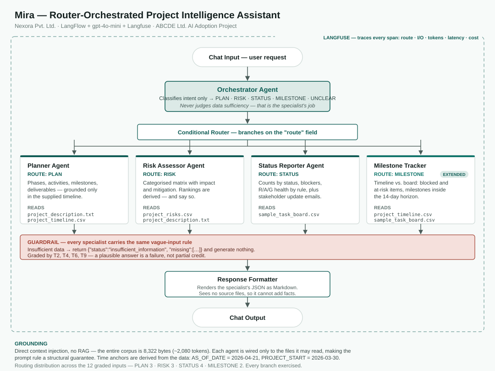

# Mira — Architecture and Design

Nexora Pvt. Ltd. · AI Adoption Project for ABCDE Ltd.
Platform: **LangFlow** · Observability: **Langfuse** · Model: **gpt-4o-mini**

---

## 1. Problem summary

Nexora's PMs run several projects at once and lose 3–4 hours building each project
plan and 1–2 hours compiling each weekly status report, with risk assessments done
inconsistently and no standard format for any of it. Mira is a router-orchestrated
multi-agent assistant that takes the ABCDE Ltd. project files as input and returns
a structured plan, a categorised risk matrix, a status report or a milestone alert
depending on what was asked. The dominant risk is fabrication — inventing
milestones absent from `project_timeline.csv`, risks absent from
`project_risks.csv`, or task statuses absent from `sample_task_board.csv` — so
every agent carries an explicit refusal rule, and that refusal behaviour is what a
third of the graded test suite exists to catch.

---

## 2. Tool selection rationale

| Category | Choice | Why |
|---|---|---|
| Workflow platform | **LangFlow** | Used in class. Visual agent builder suited to multi-agent pipelines with hand-written prompts, which is exactly Mira's shape — the value is in the prompts, not in API plumbing. Exports to JSON for submission and gives the workflow-canvas screenshot the brief requires. |
| LLM | **gpt-4o-mini** | The Playbook's recommended default. Mira's work is extraction, classification and structured generation, not deep reasoning. The whole grounding corpus is ~2,080 tokens, so a larger context model buys nothing. Cheap enough that the full 12-test suite can be re-run after every prompt change. |
| Observability | **Langfuse** | Set up in class. Connects to LangFlow through three environment variables, so there is no code to maintain. Per-agent spans give the token counts the cost analysis needs. |
| Data ingestion | **LangFlow File components** | All four sources are small local files. |
| Task board API | **None — CSV upload** | Trello integration is optional in the brief and carries no marks. It would add an auth dependency and a failure mode for zero points. |
| Authentication | **API keys via `.env`** | No OAuth anywhere in this project. |

---

## 3. Orchestration pattern: router / dispatcher

**Chosen: Router.** Requests to Mira fall into genuinely different types — "generate
a plan", "what are the risks", "status for Sprint 3", "what's coming up" — and each
needs a different agent reading a different source file.

| Pattern | Why not |
|---|---|
| Sequential pipeline | Would run all four specialists on every request. A status question would be handed to the Planner, which has no task data — precisely the situation that produces invented content. It would also cost roughly 4× per request for no gain. |
| Hierarchical | Warranted when one request must be decomposed across several agents and the results aggregated. None of the twelve graded inputs needs that; every one maps to a single specialist. Choosing it would add an aggregation step that can only introduce error. |

The Playbook's warning applies directly here: *a simple pattern that works
reliably beats a sophisticated one that breaks*. Router is the simplest pattern
that fits the input distribution.

**Routing distribution across the graded inputs:** PLAN 3, RISK 3, STATUS 4,
MILESTONE 2 — every branch is exercised by the test suite.

### The key routing decision

**The router classifies intent only. It never judges data sufficiency.**

T2 ("Generate a project plan for: *We want to build a chatbot*") has perfectly
clear intent — it is a PLAN request. What it lacks is data. If the router tried to
catch that, it would need to know what each specialist requires, which duplicates
the specialists' knowledge in a fifth place and guarantees drift. So the router
routes it to the Planner, and the Planner refuses.

Consequence: **refusal is a specialist behaviour, not a routing behaviour.**

---

## 4. Agent responsibilities

| Agent | Single responsibility | Reads | Removing it would… |
|---|---|---|---|
| **Orchestrator** | Classify intent into one of five routes | — | …force one mega-prompt holding four grounding contracts. This is the single biggest hallucination source in multi-agent designs. |
| **Planner** | Structured project plan from description + timeline | `project_description.txt`, `project_timeline.csv` | …lose T1, T2, T9. |
| **Risk Assessor** | Categorised risk matrix, with derived ranking disclosed | `project_risks.csv`, `project_description.txt` | …lose T3, T4, T7. |
| **Status Reporter** | The board as it stands: counts, blockers, health, stakeholder emails | `sample_task_board.csv` | …lose T5, T6, T10, T12. |
| **Milestone Tracker** | Timeline vs. board: at-risk milestones, upcoming deliverables | `project_timeline.csv`, `sample_task_board.csv` | …lose T8, T11 and the 8-mark extended capability. |

### Why Milestone Tracker is separate from Status Reporter

They answer different questions from different sources. Status Reporter answers
*what does the board say*; Milestone Tracker answers *what does the board say
relative to the plan*, which requires a second file and a week-to-date conversion.
Merging them would put two grounding contracts in one prompt. Keeping them apart
also means T8 and T11 fail independently, which makes debugging tractable.

### Why stakeholder emails are not a sixth agent

T12 asks for a stakeholder update email about Sprint 2. That is the same facts
from the same file as a status report, in a different wrapper — handled by an
`OUTPUT_FORMAT` flag on the Status Reporter. A separate agent would duplicate the
counting logic, and duplicated counting logic is how two parts of one answer end
up disagreeing.

---

## 5. Input-processing architecture

```
Chat Input ──► Orchestrator (classify) ──► Conditional Router ──┬─► Planner
                                                                ├─► Risk Assessor
     File components (4 CSV/TXT) ─────────────────────────────► ├─► Status Reporter
                                                                └─► Milestone Tracker
                                                                        │
                                                        Response Formatter ──► Chat Output
```

In LangFlow terms (component names vary slightly by version — match by function):

1. **Chat Input** takes the user request.
2. **File** components load the four sources from `data/`. Each specialist is
   wired only to the files it is allowed to read — an agent physically cannot
   ground itself in a file it is not connected to, which turns a prompt rule into
   a structural guarantee.
3. **Prompt + Language Model** implements the Orchestrator, returning routing JSON.
4. **Conditional Router** components branch on the `route` field. Chain them
   (PLAN? → else RISK? → else STATUS? → else MILESTONE? → else UNCLEAR).
5. Each branch is a **Prompt + Language Model + Structured Output** triple.
6. **Response Formatter** — one final prompt that renders the specialist's JSON as
   readable Markdown for the user. It receives only the JSON, never the source
   files, so it cannot add facts.
7. **Chat Output**.

---

## 6. Data-grounding strategy

**Direct context injection. No RAG.**

The entire corpus is 8,322 bytes — roughly **2,080 tokens**:

| File | Bytes |
|---|---|
| `sample_task_board.csv` | 4,146 |
| `project_risks.csv` | 1,638 |
| `project_description.txt` | 1,303 |
| `project_timeline.csv` | 1,235 |

Every specialist can hold every file it needs in its prompt with room to spare.
Retrieval would add chunking, embedding and a similarity threshold — three new
failure modes — to solve a problem that does not exist at this scale. RAG is
listed as optional in the brief; here it would actively reduce groundedness by
letting a relevant row fall below the retrieval cut.

### Derived time anchors

The sample data is historical. Using the real current date would mark every task
overdue and every milestone past, so both anchors are derived from the data and
passed to agents as constants:

| Constant | Value | Derivation |
|---|---|---|
| `AS_OF_DATE` | 2026-04-21 | Earliest due date among not-Done tasks (T006). The only date at which the board is self-consistent: later and T006 is overdue while In Progress; earlier and T001–T005 cannot be Done. |
| `PROJECT_START` | 2026-03-30 | The unique Monday where Sprint 1 (Planning) falls inside timeline Phase 1 **and** Sprint 2 (Analysis) falls inside Phase 2. Verified by exhaustive search over 8 candidate Mondays — see `eval/validate_data.py`. |

### Deterministic joins over inferred ones

Task `labels` map one-to-one onto timeline phases for Phases 1–5, so the Milestone
Tracker is given the mapping rather than asked to infer it. The mapping drifts
after Phase 5 and Phase 8 has no tasks at all; both facts are stated in the prompt
so the agent reports "unmapped" and "no tasks mapped" instead of guessing.

### Disclosed gaps in the source data

| Gap | Handling |
|---|---|
| The brief's prose says "3 Done"; the CSV has **5 Done** | Ground in the CSV. Disclose in README, results table and reflection. |
| `project_risks.csv` has no severity or likelihood column | T7's ranking is derived. The agent must populate `ranking_rule` and say the ranking is not from the data. |
| Timeline Phase 8 has no tasks | Report "no tasks mapped"; never infer progress. |

---

## 7. Agent communication pattern

Agents do not talk to each other. The Orchestrator emits routing JSON; exactly one
specialist runs; its JSON goes to the Response Formatter. There is no shared
scratchpad and no multi-turn negotiation.

This is deliberate. Every inter-agent message is a place where one agent's
uncertainty becomes another agent's premise, and it also multiplies the trace
surface. With a single hop, any wrong answer is attributable to exactly one agent
in the Langfuse trace, which is what makes the evaluate-fix-re-evaluate loop
practical inside two weeks.

---

## 8. Guardrails against hallucination

Five layers, cheapest first:

1. **Structural** — each specialist is wired only to the files it may read.
2. **Field-level provenance** — every schema field is marked as *copied from
   source* or *composed*. Composed fields are rare and explicitly bounded (for
   example `project_relevance` may only reference something stated in the
   description).
3. **The vague-input rule** — every prompt ends with a fixed refusal object and
   the instruction not to produce content in that case. This is the Playbook's
   single most emphasised guardrail: *most hallucination happens because the agent
   was never told what to do when it lacks information*.
4. **Derived-value disclosure** — anything Mira computes rather than reads
   (rankings, health ratings, phase dates) must be accompanied by the rule that
   produced it.
5. **Arithmetic instruction** — the Status Reporter is told to count rows and
   recount if totals disagree, because counting is the one task where a language
   model's plausible answer is most likely to be quietly wrong.

### Uniform refusal shape

All four refusal tests return the same structure, so the behaviour reads as
systematic rather than incidental:

```json
{
  "status": "insufficient_information",
  "message": "Insufficient information to generate a <artefact>.",
  "missing": ["<specific item>", "..."],
  "<payload field>": null
}
```

---

## 9. Structured output schemas

Full schemas live in each prompt file under `workflow/prompts/`. Every specialist
returns JSON with a `status` field of `generated` or `insufficient_information`,
and a `source_files` array naming what it read. Common contract:

| Field | Present in | Purpose |
|---|---|---|
| `status` | all | Distinguishes an answer from a refusal without parsing prose |
| `source_files` | all generated responses | Makes groundedness checkable, and feeds the plan-groundedness metric |
| `assumptions` / `ranking_rule` / `health_reason` | where relevant | Forces derived values to declare themselves |

Use LangFlow's **Structured Output** component on each specialist so malformed
JSON fails loudly at the node rather than silently downstream.

---

## 10. Error and refusal handling

| Situation | Behaviour |
|---|---|
| Intent unclear | Orchestrator returns `UNCLEAR`; the formatter asks the user which of the four things they want. No specialist runs. |
| Intent clear, data absent | Specialist returns `insufficient_information` with a populated `missing` list. |
| Specialist returns malformed JSON | Structured Output component raises; surfaced as an error rather than passed on. Recorded in the results table. |
| Requested scope is empty (e.g. a sprint with no tasks) | `status: generated` with zero-filled counts and an explicit note. An empty result is a valid answer; a fabricated one is not. |

Refusals are **successful outcomes**, and are traced as such — a run that
correctly refuses is a pass, and the Langfuse trace should make that visible
rather than looking like a failure.

---

## 11. Observability approach

Langfuse via environment variables in LangFlow:

```
LANGFUSE_PUBLIC_KEY=...
LANGFUSE_SECRET_KEY=...
LANGFUSE_HOST=https://cloud.langfuse.com
```

Captured per run:

| Signal | Why it matters |
|---|---|
| Route chosen by the Orchestrator | A correct answer via the wrong agent is a design defect the output alone hides |
| Input and output of each agent span | Localises a failure to one prompt |
| Token counts per span | Feeds the cost-per-user-per-day analysis with real numbers, not estimates |
| Latency per span | Identifies which agent dominates response time |
| `status` field value | Separates refusals from failures in aggregate |

Tag every run with its test ID (`T1`…`T12`) so the trace list and the results
table line up one-to-one.

**Analysis to perform** (Playbook §6.2): compare token cost on vague inputs
against detailed ones. Hallucination typically produces *longer* output, so a
vague input costing more than a detailed one is a signal that the refusal rule is
not firing.

---

## 12. Production metrics

| Metric | Definition | Measured from |
|---|---|---|
| **Plan groundedness** | % of milestones in a generated plan traceable to `project_timeline.csv` | Compare output milestones against the source list |
| **Risk relevance** | % of returned risks carrying a valid `risk_id` from R01–R10 | Schema check against the CSV |
| **Status accuracy** | % of runs whose task counts match the CSV exactly | Compare against `validate_data.py` output |

All three are computable without human judgement, which is what makes them usable
in production rather than only at grading time.

---

## 13. Architecture diagram



Source: [`diagrams/mira_architecture.svg`](diagrams/mira_architecture.svg)
